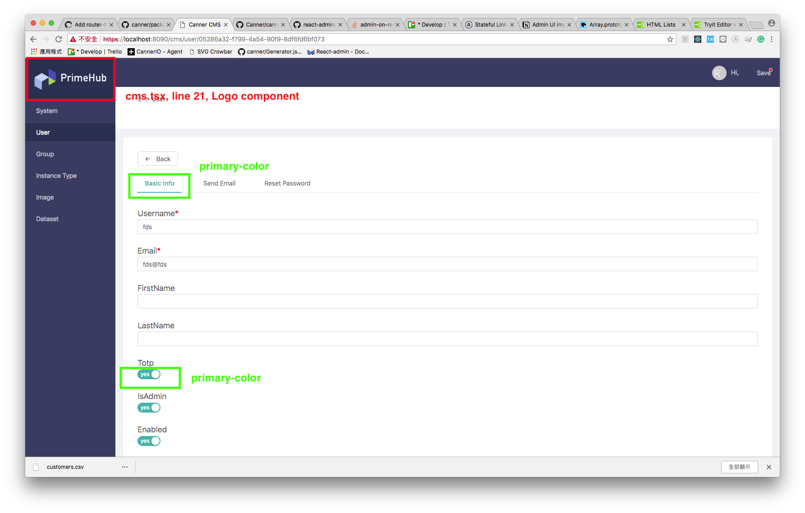

## Dev

```
npm run start
```

## Prod

```
npm run build
```

All static files (js, css, img...) will be in folder `client/dist`.

## Override Antd Style

1. Run `npm run start` to develop.
2. Open the `package.json`, you will see the `theme` fields with serveral style settings like:

```json
...
"theme": {
  "menu-dark-bg": "#373d62",
  "layout-sider-background": "#373d62",
  "layout-header-background": "#373d62",
  "primary-color": "#27B1AB",
  "btn-primary-bg": "#27B1AB",
  "info-color": "#3B52BC",
  "menu-dark-item-selected-bg": "#283050",
  "menu-dark-item-active-bg": "#283050",
  "table-row-hover-bg": "rgba(222, 229, 241, 0.37)",
  "item-active-bg": "rgba(222, 229, 241, 0.37)",
  "item-hover-bg": "rgba(222, 229, 241, 0.37)",
  "font-size-base": "14px"
},
```

You can edit this object to change the style of CMS.

Here is some images point out those variables we used.




And you can find all variables [here](https://github.com/ant-design/ant-design/blob/master/components/style/themes/default.less).
